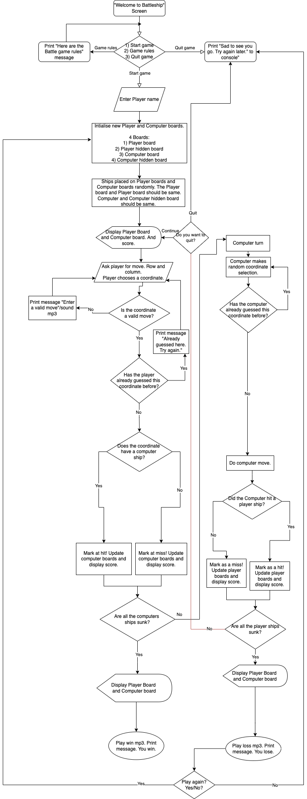

<h1 id="return-to-the-top"><a href="https://ultimate-battleship.herokuapp.com/" alt="Try the game!">Ultimate Battleship</a></h1>
<h2>Ibrahim Murphy</h2>

<h1>The Why</h1>

Battleship is a strategy type guessing game for two players. It is played on ruled grids (paper or board) on which each player's fleet of ships (including battleships) are marked. The locations of the fleets are concealed from the other player. Players alternate turns calling "shots" at the other player's ships, and the objective of the game is to destroy the opposing player's fleet. The site’s goal is to provide a challenging game to entertain, but also educate online users into the rules/workings of the game.

<h2><b>The Rules</b></h2>
<ol>
<li>The board is 7 x 7</li><li>
Each player has 5 ships</li><li>
Ships are placed randomly</li><li>
Ships cannot overlap with each other</li><li>
Ships cannot be placed in the same position</li><li>
Ships cannot be placed on the edge of the board</li><li>
Players take turns firing shots (calling out grid coordinates)</li><li>
Grid coordinates have the following format (e.g): "1,a", "2,b", "4,e"</li><li>
Players attempt to hit the opponent's enemy ships.</li><li>
When a ship it "hit", it is considered sunk</li><li>
As soon as all of one player's ships have been sunk, the game ends.</li></ol>

<h1>User Experience(UX)</h1>
<h2>Target Audience</h2>
<ul>
<li>People who enjoy easy-to-play online logic games.</li>
<li>People wanting to learn the basic rules of Battleship.</li>
<li>People of all ages.</li>
</ul>

First time user:

<ol>
<li>As a user I would like to play a logic-based game.</li>
<li>As a user I would like to be able to learn the rules of the game.</li>
</ol>

Returning User:

<ol>
<li>I would want to be able to play the game easily.</li>
</ol>

As a site creator:

<ol>
<li>I want to make the game to be simple and intuitive.</li>
<li>I want to ensure there is a challenging aspect of the game for the user.</li>
<li>I want to make sure the user learns the rule of the game quickly.</li>
<li>The application provides a working battleships game for a single user to play against the computer</li>
</ol>
<h2>User Stories</h2>
<h2>Strategy</h2>

Create an interactive, fun game that is easy to pick up and play. The aim is provide consistent styling across all pages ensuring that the application runs flawlessly across all major devices. The code should be intuitive read and allow for updates to be made easily, for those wishing to implement improved features in future.

<ul>
<li>To provide a fun and interactive game application.</li>
<li>The user should have a target to win the game.</li>
<li>The user should be able to learn the rules of the game quickly.</li>
</ul>

<h2>Scope</h2>

The scope of Ultimate Battleship game in its first release is defined by the following features:

<ol>
<li>Functioning Battleship game</li>
<li>Ability to keep a scoring system</li>
<li>A game over ending state</li>
<li>Rules  to explain the game</li>
</ol>

Features to be considered for future releases:

<ol>
<li>A game with different ship sizes</li>
<li>Ability to play against another human player online</li>
<li>Ability to change the number of ships</li>
<li>Ability to pick the size of the grid</li>
</ol>
<h2>Structure</h2>

The structure for the game has been designed to allow for the user to pick up and play quickly. The 3 options for the application are very clear.

<ul>
<li>Main Menu
<ul><li>When you run the application, you're introduced to the Battleship introduction screen and shown a main menu </li>
<li>The main menu 3 otpions will include Start Game, Game rules and Quit game</li>
</ul></li>
</ul>
<ul>
<li>Start Game
<ul>
<li>Player name requested as input</li>
<li>A board/ocean for Player</li>
<li>A board/ocean for Computer</li>
<li>A hidden board/ocean for Player</li>
<li>A hidden board/ocean for Computer</li>
<li>A scoring system, which records current score</li>
</ul></li>
</ul>
<ul>
<li>Rules page
<ul>
<li>Detailing the rules of the Battleship game</li>
</ul></li>
</ul>

<h2>Skeleton</h2>
<h3>Flowchart</h3>

<ul>
<li>Workflow of the game</li>

</ul>

<h1>Features</h1>
<h2>Current Features</h2>

<ul>
<li>Human vs Computer mode</li>
<li>7 vs 7 ocean grid</li>
<li>5 ships of the same size</li>
<li>Random computer select</li>
<li>A game over ending state</li> 
</ul>

<h2>Future Features</h2>

<li>A game with different ship sizes</li>
<li>Ability to play against another human player online</li>
<li>Ability to change the number of ships</li>
<li>Ability to pick the size of the grid/ocean beforehand</li>

<h1>Technologies</h1>
<h2>Languages</h2>

The game utilises Python, HTML5, CSS3 and JavaScript programming languages.

<h2>Other Technologies, Frameworks & Libraries</h2>

<li><a href="https://www.gitpod.io/" target="_blank">Gitpod</a> - The project was created and developed using the open sourced platform Gitpod</li>
<li><a href="https://github.com/" target="_blank">GitHub</a> - This project used GitHub allow access to the project code and store the project remotely.</li>
<li><a href="https://www.heroku.com/" target="_blank">Heroku</a> - Heroku is a cloud platform as a service supporting several programming languages</li>
<li><a href="http://ami.responsivedesign.is/" target="_blank">Am I responsive design website</a> - for the preview images across different devices</li>
<li><a href="https://app.diagrams.net/" target="_blank">Flowchart Maker & Online Diagram Software website</a> - for the workflow/flowchart of the game</li>

<h1>Testing</h1>

<h2>Validator testing</h2>

<a href="http://pep8online.com/" target="_blank">PEP8 Online</a> 
The Python code has been tested with the PEP8 Online check validator and <a href="images/PEP8-online-pass.png" target="_blank">passed</a> with no issues.  

<h2>Device tests</h2>

Testing across the following browsers:

<ul>
<li>Checked the character size and ensuring it fit in the heroku app window</li><li>
Checked conditions around the name of users to ensure it's alphabetic and had no spaces</li><li>
Checked conditions around entering an invalidate co-ordinate outside of grid</li>
<li>Checked conditions around entering the same co-ordinate twice.</li>
<li>Checked conditions using CAPS and lower case in input fields</li>
<li>Checked conditions trying to quit the game.</li>
<li>Checked conditions entering nothing in input fields</li>
</ul>
<table>
  <tr>
    <th>Screen v Browser</th>
    <th>Chrome </th>
    <th>Brave</th>
      <th>Firefox</th>
  </tr>
  <tr>
    <td>Desktop</td>
    <td>	&#10003;</td>
    <td>	&#10003;</td>
      <td>	&#10003;</td>
  </tr>
  </table>
  
If I had more time, I would have liked to have done more user testing, especially against the user stories defined above. I was only able to get family members (new users) to test, and no issues were found.

<h2>Bugs & Fixes</h2>

<ol>
<li> FIXED -- Co-ordinates in lowercase was initially considered invalid input  Added lowercase to the dictionary, so it related to the same column as uppercase.</li>
<li> FIXED -- Computer random selection. Initially the random selection for the computer choice didn't have an escape condition (for when a computer randomly selects the same co-ordinate twice). Added while and if condition which meant that the computer could only return a co-ordinate guess, if the co-ordinate was for an empty cell</li>
<li> FIXED -- Player name initially had no checks on it and an empty name field could be entered  Added an isalpha() function on name to ensure something [A-Za-z] valid was entered</li>
</ol>

<h1>Deployment</h1>

## Heroku Deployment

To deploy Ultimate Battleship game to Heroku, take the following steps:

1. Create a `requirements.txt` file using the terminal command `pip freeze > requirements.txt`.

2. Create a `Procfile` with the terminal command `echo web: python app.py > Procfile`.

3. `git add` and `git commit` the new requirements and Procfile and then `git push` the project to GitHub.

3. Create a new app on the [Heroku website](https://dashboard.heroku.com/apps) by clicking the "New" button in your dashboard. Give it a name and set the region to whichever is applicable for your location.

4. From the heroku dashboard of your newly created application, click on "Deploy" > "Deployment method" and select GitHub.

5. Confirm the linking of the heroku app to the correct GitHub repository.

6. In the heroku dashboard for the application, click on "Settings" > "Reveal Config Vars".

7. Set the following config vars:

| Key | Value |
--- | ---
PORT | `<8000>`

8. From the command line of your local IDE:
    - Enter the heroku postres shell 
    - Migrate the database models 
    - Create your superuser account in your new database
    
     Instructions on how to do these steps can be found in the [heroku devcenter documentation](https://devcenter.heroku.com/articles/heroku-postgresql).

9. In your heroku dashboard, click "Deploy". Scroll down to "Manual Deploy", select the master branch then click "Deploy Branch".

10. Once the build is complete, click the "View app" button provided.

11. From the link provided add `/admin` to the end of the url, log in with your superuser account and create instances of ShippingDestination and Product within the new database.

12. Once instances of these items exist in your database your heroku site will run as expected.

<h2>Forking Repository</h2>

Forking the GitHub Repository makes a copy of the original repository so that you can view and/or make changes without affecting the original repository. To do this:

<ol>
<li>Go to <a href="https://github.com/" target="_blank">Github</a> and log in.</li>
<li>Locate the repository - follow this link for the <a href="https://github.com/ibromurph/ultimate-battleship" target="_blank">Ultimate Battleship repository</a></li>
<li>Above the <b>Settings</b> button on the menu, on the right-hand side locate the <b>Fork</b> Button. It is next to the star button.</li>
<li>You should now have a copy of the original repository in your GitHub account.</li>
</ol>
<h2>Cloning the project</h2>

To clone from Github:
<ol>
<li>Go to <a href="https://github.com/" target="_blank">Github</a> and log in.</li>
<li>Locate the repository - follow this link for the <a href="https://github.com/ibromurph/ultimate-battleship" target="_blank">Ultimate Battleship repository</a></li>
<li>Under the repository name, click the green <b>Clone or download</b> button.</li>
<li>To clone the repository using HTTPS, copy the link under <b>Clone with HTTPS.</b></li>
<li>Open a terminal and if you need to, change the current working directory to the location where you want the cloned directory to be made.</li>
<li>Type <code>git clone</code>, and then paste the URL you copied in Step 3 on GitHub.</li>
 <code>$ git clone https://github.com/YOUR-USERNAME/YOUR-REPOSITORY`</code>
<li>When you press Enter, your local clone will be created</li>
</ol>
Further information and troubleshooting on cloning a repository from Github can be found on <a href="https://docs.github.com/en/github/creating-cloning-and-archiving-repositories/cloning-a-repository" target="_blank">GitHub Docs</a>.

<h1>Credits</h1>

All of the text written in this project has been written by the developer.

<h2>Media/Content</h2>

<h2>Code</h2>

The following literature and tutorials assisted me in writing code:

<ul>
<li><a href="https://www.youtube.com/watch?v=xz9GrOwQ_5E">Coding Advanced Battleship Part I in Python</a> - helped give me on the struture and some of the functions I may need in my own game.</li>
<li><a href="https://codeinstitute.net/">Code Institute</a> - a great learning platform that has helped me get to this point and also provided the github template to begin this piece of work</li>
</ul>
<h2>Acknowledgements</h2>

Thanks and sincere appreciation to:
<ul>
<li>Mentor Chris Quinn whose experience, advice and suggestions enabled this developer to complete this task.</li>

<li>Charles Murphy whose advice and explanations helped this developer move forward in this project with his expert source knowlegde.</li>
</ul>

<a href="#return-to-the-top" alt="Return to the top">RETURN TO THE TOP</a>